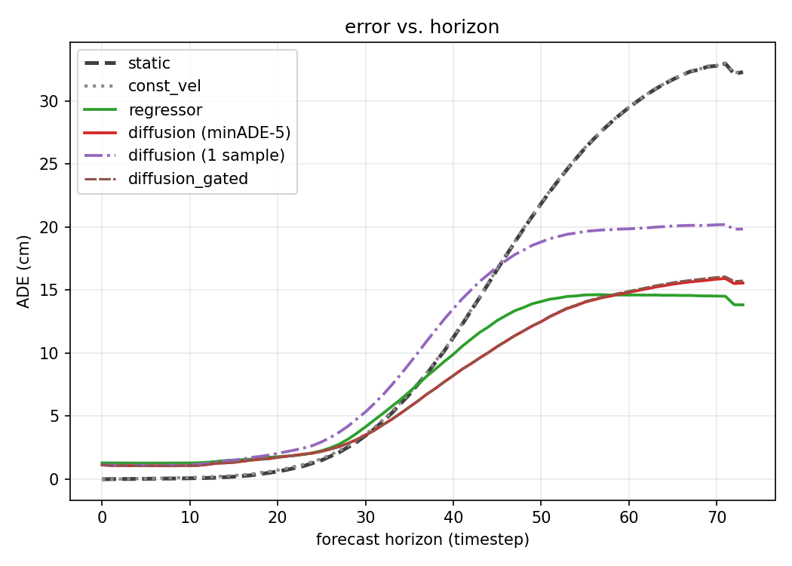

# ForeTrack4D

3D object motion forecasting from a single image. Given one frame of a hand-object
interaction and a set of query points on the object, a conditional diffusion model predicts
world-space 3D trajectories (X, Y, Z per point per timestep) over a long horizon. The output
is 3D point tracks, not pixels.

The design transplants the ForeHand4D recipe (single-image diffusion forecasting of bimanual
hand motion) from hands to objects, and uses TAPIP3D (feed-forward 3D point tracking) to
pseudo-label in-the-wild video. ForeHand4D forecasts the hands and names object motion as
future work; this repository is an attempt at that.

## Method

- **Output**: (T, N, 3) point tracks. N = 64 farthest-point-sampled query points, T = 128
  forecast steps, world frame = camera frame at t=0.
- **Conditioning**: a single RGB image (ViT encoder, HaMeR init) plus one token per query
  point: Fourier-embedded 3D position at t=0 concatenated with the ViT patch feature at its
  2D projection. No motion history.
- **Denoiser**: MDM-style transformer encoder over per-timestep tokens, x0 prediction, cosine
  schedule, depth-scaled L2 loss. The output head predicts an offset from the known t=0
  position rather than an absolute coordinate.
- **Training**: Stage 1 on ground-truth tracks derived from lab-dataset meshes and 6DoF poses
  (DexYCB, ARCTIC including articulated objects, H2O); Stage 2 finetunes on those plus
  TAPIP3D-imputed pseudo-labels from HoloAssist, filtered by jerk, depth-variance and
  visibility gates. A same-architecture regressor (no diffusion) is trained alongside as the
  primary baseline.

## Results

All numbers in cm, lower is better except APD3D. **M-F** is first-frame-aligned and **M-G**
globally aligned, following ForeHand4D: single-image metric depth is scale-ambiguous, so the
aligned variants separate motion-shape error from absolute placement error.

Two diffusion rows are reported, and the distinction matters:

- **minADE₅** picks the best of 5 samples *using the ground truth*. This is the standard
  multi-hypothesis metric, but it gives the diffusion model an oracle the deterministic
  baselines do not get.
- **1 sample** is the expected error of a single draw — what deployment actually delivers.

### DexYCB, held-out test split (n = 1200)

| method | ADE | FDE | M-F | M-G | APD3D |
|---|---|---|---|---|---|
| static | 12.46 | 33.36 | 12.46 | 12.85 | 43.48 |
| constant velocity* | 12.52 | 33.40 | 12.52 | 12.87 | 40.25 |
| regressor | **7.85** | **14.50** | **7.55** | **7.63** | 12.44 |
| diffusion (minADE₅) | 7.43 | 15.91 | 7.36 | 7.65 | 14.94 |
| diffusion (1 sample) | 10.45 | 20.19 | 10.41 | 10.33 | 13.58 |
| diffusion + OOD gate | 7.45 | 16.05 | 7.39 | 7.69 | 15.15 |

\* constant velocity uses the true second frame, which the model never sees. It is listed for
reference, not as a fair comparison.

Both learned models beat the baselines decisively in-domain: FDE drops from 33.4cm to 14.5cm,
a 57% reduction at the end of the horizon. **The regressor beats single-sample diffusion on
every accuracy metric.** Diffusion only edges ahead under oracle selection. This matches the
in-domain pattern ForeHand4D reports, where the diffusion model's advantage is the shape of
its output distribution rather than raw single-sample accuracy.

### HoloAssist pseudo-label val (n = 43) and EgoExo4D zero-shot (n = 25)

| method | HoloAssist ADE | HoloAssist FDE | EgoExo4D ADE | EgoExo4D FDE |
|---|---|---|---|---|
| static | **5.32** | **7.91** | **19.76** | **25.57** |
| constant velocity* | 16.42 | 33.65 | 41.27 | 83.02 |
| regressor | 5.83 | 8.36 | 23.41 | 33.72 |
| diffusion (minADE₅) | 8.49 | 14.91 | 23.83 | 29.65 |
| diffusion (1 sample) | 11.90 | 21.65 | 23.85 | 29.82 |
| diffusion + OOD gate | 8.44 | 14.94 | 20.93 | 26.87 |

**Static wins both.** On out-of-domain video the model does not beat assuming the object stays
still. The inference-time OOD gate recovers part of the zero-shot gap (23.83 → 20.93) but does
not close it. These two splits are small (n = 43 and n = 25), so treat them as directional.

### Motion diversity

ForeHand4D judges a generative forecaster by whether its motion distribution *matches* the
ground-truth distribution, not by whether it is large. Mean pairwise L2 between motions drawn
across the dataset:

| setting | predicted | ground truth | verdict |
|---|---|---|---|
| DexYCB test | 12.97 | 12.15 | well calibrated (6.7% high) |
| HoloAssist pseudo-val | 12.02 | 8.04 | over-predicts motion |
| EgoExo4D zero-shot | 0.97 | 33.30 | collapsed |

In-domain the diffusion model reproduces the real spread of object motion closely — the same
criterion ForeHand4D passes on ARCTIC (41.14 predicted vs 39.16 ground truth). Out of domain
the distribution collapses: per-input multimodality falls to 0.23cm, meaning all five samples
are effectively identical, which is why minADE₅ and single-sample numbers coincide there.

### Error vs horizon



Error is not uniform over the horizon. Early on the object has barely moved, so the static
baseline is nearly exact while the model commits to motion slightly too soon. Later the
baseline diverges and the learned models flatten out. Aggregate ADE hides this; the curve does
not. The two baselines track each other closely enough to overlap for most of the horizon.

## Limitations

- **Zero-shot generalization does not reproduce.** ForeHand4D's headline result is that
  imputed labels improve zero-shot EgoExo4D performance. For objects, at our pseudo-label
  scale (213 accepted clips, versus their full HoloAssist + AssemblyHands), it does not: the
  model loses to a static baseline on both out-of-domain splits.
- **Diffusion does not beat a plain regressor on single-sample accuracy.** Its measurable
  advantage in-domain is a correctly calibrated distribution of futures, plus best-of-5
  accuracy when a downstream selector exists.
- **Out-of-domain diversity collapse** is quantified above and only partly mitigated by the
  OOD gate.
- **Small out-of-domain eval sets** (n = 43 and n = 25). The in-domain result (n = 1200) is
  well powered; the others are not.
- **No comparison against a published forecasting method.** Baselines are static, constant
  velocity, and a same-architecture regressor. ForeHand4D additionally adapts LatentAct as a
  competitor; there is no equally direct analog for object track forecasting, but this remains
  a gap.
- **Sampling is stochastic**; repeated runs on a single clip vary by roughly ±25%. Aggregate
  numbers over full splits are stable; per-clip numbers are not.
- **Single-image metric depth is scale-ambiguous**, so ADE does not start at zero. M-F is the
  metric to read for motion-shape accuracy.

## Demo

`demo/` is a "forecast vs. reality" web demo: upload a short single-shot hand-object video,
pick a conditioning frame, and the backend tracks observed reality with TAPIP3D + MegaSaM,
samples K forecasts from that frame, and renders a side-by-side video — the left panel plays
the real clip while the right freezes on the conditioning frame and animates the predicted
trajectories against what actually happened, alongside a metric 3D view and a live
error-vs-baseline chart. No pixels are synthesized. See `demo/README.md`.

Rendered example clips are illustrative, not evidence: they were selected from held-out splits
by ranking on forecast quality, so they are not an unbiased sample. The tables above are the
result.

## Setup

Training stack: Python 3.10, torch 2.4.1 / cu124.

```
pip install -e ".[dev]"
```

Three separate environments are required; do not unify them:

1. **Training env** (this repo's `pyproject.toml`): training, eval, and forecaster inference.
2. **tapip3d env**: built per TAPIP3D's README (compiles `pointops2` and MegaSaM's
   extensions). Runs TAPIP3D `inference.py` and MegaSaM. MegaSaM's checkpoints
   (Depth-Anything V1, RAFT) must be downloaded separately per its README.
3. **labeling env** (`pip install -e ".[labeling]"`, plus SAM2 from the `third_party/sam2`
   clone): hand detection, SAM2 masking, and the demo app/worker.

Cross-environment calls go through `subprocess` with `.npz` files on disk, never
cross-environment imports (`src/foretrack/labeling/run_tapip3d.py`, `scripts/forecast_infer.py`).

`scripts/setup_third_party.sh` clones TAPIP3D and SAM2 into `third_party/` (not committed).
MANO model files are required by the dataloaders: register at the MANO site, place them under
`downloads/model/body_models/mano`, and set `DOWNLOADS_DIR`.

Some cluster nodes fail cuDNN handle creation while plain CUDA kernels work; set
`FORETRACK_DISABLE_CUDNN=1` to fall back (the only convolution is the ViT patch embed).

## Data

DexYCB, ARCTIC (ego split), and H2O for ground-truth tracks (mixed via the dataset-string
config, e.g. `dexycb+arctic_ego+h2o`); HoloAssist for pseudo-labels; EgoExo4D for zero-shot
evaluation only, never for training. See `configs/` and `src/foretrack/data/`.

## Train

```
python scripts/train.py --config configs/mixed_stage1.yaml --model_type diffusion
python scripts/train.py --config configs/mixed_stage2.yaml --model_type diffusion
```

## Eval

```
python scripts/eval.py --config configs/mixed_stage2_diffusion_lowlr_expanded.yaml \
    --diffusion_ckpt <path> --regressor_ckpt <path> \
    --eval_dataset dexycb --split test --ood_gate \
    --horizon_plot horizon.png
```

Reports ADE, FDE, M-F, M-G and APD3D for every baseline, both diffusion readouts, per-input
multimodality, and dataset-level diversity against the ground-truth reference. `--ood_gate`
adds a row that falls back to the static baseline when conditioned and unconditional
predictions nearly agree (`src/foretrack/eval/ood_gate.py`).

## License

CC BY-NC 4.0 (see LICENSE), required by code adapted from forehand4d. Per-module provenance is
in NOTICE.md.

## Acknowledgements

Built on:

- ForeHand4D (Prakash, Forsyth, Gupta) — forecasting architecture and training recipe.
  https://github.com/ap229997/forehand4d
- TAPIP3D (Zhang, Ke, Harley, Fragkiadaki) — 3D point tracking used for pseudo-labeling.
  https://github.com/zbw001/TAPIP3D
- MDM (Tevet et al.) — diffusion backbone. https://github.com/GuyTevet/motion-diffusion-model
- SAM 2 (Meta) — object mask extraction. https://github.com/facebookresearch/sam2
