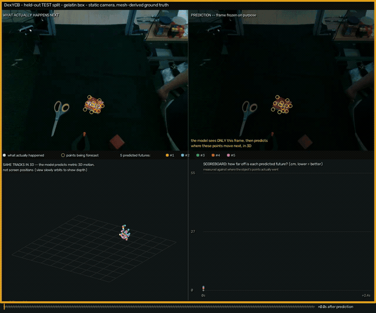
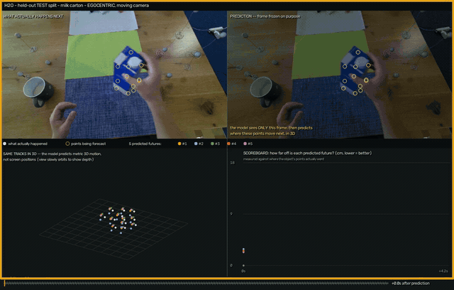

# ForeTrack4D

**Forecasting the 3D motion of a hand-held object from a single RGB image.** Given one frame
and a set of query points on the object, a conditional diffusion model predicts where those
points travel in metric 3D over the next several seconds. The output is 3D point tracks, not
pixels.



*Left: the real video. Right: frozen at the moment of prediction — colored trails are five
sampled futures, white is what actually happened. Bottom: the same tracks in metric 3D, and
error against the "object never moves" baseline. DexYCB held-out test split.*

ForeHand4D forecasts **hands** from a single image and names object motion as future work.
ForeTrack4D is that follow-on: the same diffusion recipe retargeted to objects, using TAPIP3D
to pseudo-label in-the-wild video where no 3D ground truth exists.

## How it works

- **Output** — (T, N, 3) tracks: 64 query points, 128 timesteps, in the camera frame at t=0.
- **Conditioning** — one RGB frame through a ViT, plus a token per query point combining its
  Fourier-embedded 3D position with the ViT patch feature at its 2D projection. No motion history.
- **Denoiser** — MDM-style transformer encoder, x0 prediction, cosine schedule, depth-scaled L2.
  The head predicts an offset from the known t=0 position, so "no motion" is free to represent.
- **Training** — Stage 1 on mesh-derived ground truth (DexYCB, ARCTIC, H2O); Stage 2 adds
  TAPIP3D pseudo-labels from HoloAssist, filtered by jerk, depth-variance and visibility gates.

## Results

DexYCB held-out test split, n = 1200. All in cm, lower is better.

| method | ADE | FDE | M-F | M-G |
|---|---|---|---|---|
| static (object never moves) | 12.46 | 33.36 | 12.46 | 12.85 |
| constant velocity* | 12.52 | 33.40 | 12.52 | 12.87 |
| **regressor** | **7.85** | **14.50** | **7.55** | **7.63** |
| diffusion, best of 5 samples† | 7.43 | 15.91 | 7.36 | 7.65 |
| diffusion, single sample | 10.45 | 20.19 | 10.41 | 10.33 |

\* uses the true second frame, which the model never sees. †picks the closest of 5 samples using
ground truth — an oracle the deterministic baselines do not get.

Error at the final predicted frame drops from **33.4cm to 14.5cm**. M-F and M-G are
first-frame- and globally-aligned variants, following ForeHand4D: single-image metric depth is
scale-ambiguous, so alignment separates motion-shape error from absolute placement error.

**Diversity.** A generative forecaster should reproduce the ground-truth spread of motion, not
maximize it. Mean pairwise L2 between motions across the dataset:

| | predicted | ground truth |
|---|---|---|
| DexYCB test | 12.97 | 12.15 |
| EgoExo4D zero-shot | 0.97 | 33.30 |

In-domain the model matches real motion spread closely. Out of domain it collapses — all five
samples become near-identical.



*H2O, held-out test split: same model, egocentric moving camera.*

## What does not work

- **Out-of-domain, a static baseline wins.** On HoloAssist (5.32 vs 8.49) and EgoExo4D
  zero-shot (19.76 vs 23.83), predicting no motion beats the model. ForeHand4D's headline
  result — imputed labels improving zero-shot generalization — does not reproduce for objects
  at this pseudo-label scale (213 accepted clips).
- **Diffusion does not beat a plain regressor** on single-sample accuracy. Its measurable
  advantage is the calibrated output distribution, plus best-of-5 when a selector exists.
- **Small out-of-domain eval sets** (n = 43 and n = 25); those rows are directional only.
- **No published-method baseline.** Comparisons are against static, constant velocity, and a
  same-architecture regressor.

## Demo

`demo/` is an async upload → queue → results web demo: pick a conditioning frame, and the
backend tracks observed reality with TAPIP3D + MegaSaM, samples forecasts, and renders the
comparison above. See `demo/README.md`. Rendered clips are illustrative — they were selected
by ranking on forecast quality, so the tables above are the evidence, not the clips.

## Engineering

3D perception and generative modelling end to end: mesh-and-pose ground-truth track generation
with z-buffer visibility, a conditional diffusion transformer, multi-dataset training with
per-dataset normalization, and an automated pseudo-labeling pipeline (SAM 2 → depth lift →
TAPIP3D → quality gates) for video with no 3D labels.

Evaluation is the part that mattered most: ADE/FDE, alignment-invariant variants, TAPVid-3D's
depth-adaptive APD3D, distribution-level diversity against a ground-truth reference, and
error-vs-horizon curves — with an oracle-free single-sample row so the diffusion model is
compared like-for-like against deterministic baselines.

Runs across three mutually incompatible Python environments (training, TAPIP3D + MegaSaM, SAM 2
+ mediapipe) that communicate by subprocess and `.npz` on disk, on a multi-GPU cluster.

**Stack** — PyTorch, diffusion models, ViT, SAM 2, TAPIP3D, MegaSaM, OpenCV, Flask.

## Setup

Python 3.10, torch 2.4.1 / cu124.

```
pip install -e ".[dev]"
```

Three environments are required and must not be unified: the training env (this
`pyproject.toml`), a `tapip3d` env built per TAPIP3D's README, and a labeling env
(`pip install -e ".[labeling]"` plus SAM 2 from `third_party/`). `scripts/setup_third_party.sh`
clones TAPIP3D and SAM 2. MANO model files are required by the dataloaders: register at the
MANO site, place them under `downloads/model/body_models/mano`, and set `DOWNLOADS_DIR`.

Set `FORETRACK_DISABLE_CUDNN=1` on nodes where cuDNN handle creation fails.

## Train and eval

```
python scripts/train.py --config configs/mixed_stage1.yaml --model_type diffusion
python scripts/train.py --config configs/mixed_stage2.yaml --model_type diffusion

python scripts/eval.py --config configs/mixed_stage2_diffusion_lowlr_expanded.yaml \
    --diffusion_ckpt <path> --regressor_ckpt <path> \
    --eval_dataset dexycb --split test --ood_gate --horizon_plot horizon.png
```

Data: DexYCB, ARCTIC (ego), H2O for ground truth; HoloAssist for pseudo-labels; EgoExo4D for
zero-shot evaluation only, never training.

## License

CC BY-NC 4.0 (see LICENSE), required by code adapted from forehand4d. Per-module provenance is
in NOTICE.md.

## Acknowledgements

- ForeHand4D (Prakash, Forsyth, Gupta) — architecture and training recipe.
  https://github.com/ap229997/forehand4d
- TAPIP3D (Zhang, Ke, Harley, Fragkiadaki) — 3D point tracking for pseudo-labeling.
  https://github.com/zbw001/TAPIP3D
- MDM (Tevet et al.) — diffusion backbone. https://github.com/GuyTevet/motion-diffusion-model
- SAM 2 (Meta) — object masks. https://github.com/facebookresearch/sam2
